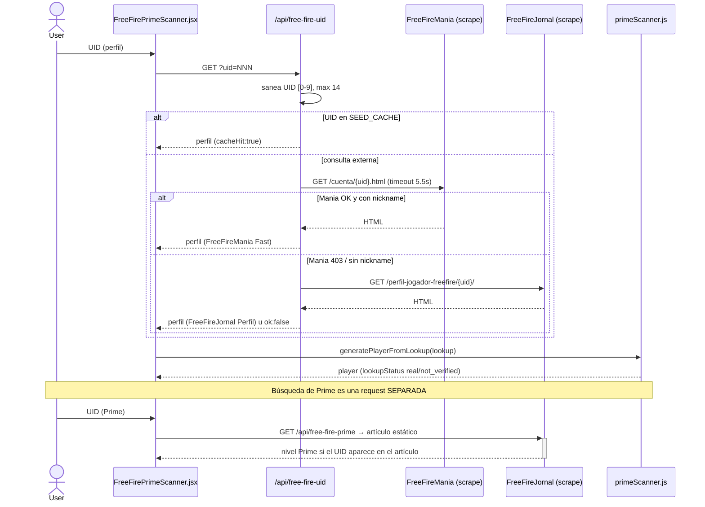

# PRIME_SCANNER_DATA_FLOW

> Flujo real verificado en `api/free-fire-uid.js`, `api/free-fire-prime.js`, `src/pages/FreeFirePrimeScanner.jsx`. Commit `36d2714`.

## 1. Explicación escrita

El scanner tiene **dos búsquedas independientes** (perfil y Prime) que NO comparten request. El usuario puede correr una sin la otra.

### Búsqueda de perfil (`/api/free-fire-uid`)
1. Usuario escribe UID → `UIDSearchForm` normaliza a dígitos.
2. `scanUidValue` (`FreeFirePrimeScanner.jsx:48`) anima pasos y hace `fetch('/api/free-fire-uid?uid=...')`.
3. El handler (`free-fire-uid.js:46`):
   - Setea CORS `*`, responde OPTIONS.
   - Sanea `uid` (`[0-9]`, máx 14).
   - `SEED_CACHE[uid]`? → responde inmediato (`cacheHit:true`).
   - Sino: fetch a **FreeFireMania** (`https://www.freefiremania.com.br/cuenta/{uid}.html`, timeout 5.5s) → `parseFreeFireManiaProfile` → si hay `nickname`, responde (`provider: FreeFireMania Fast`).
   - Si Mania falla/no da nickname: fetch a **FreeFireJornal** (`https://freefirejornal.com/es/perfil-jogador-freefire/{uid}/`) → `parseFreeFireJornalProfile` → responde (`provider: FreeFireJornal Perfil`) o `ok:false`.
4. Cliente: `generatePlayerFromLookup` (`primeScanner.js:226`) mapea a `player` con `lookupStatus`. Si no hay datos reales → muestra "Cuenta no verificada" sin inventar nada.

> **Realidad en producción**: FreeFireMania responde **403 a las IPs de Vercel**, así que el camino efectivo hoy es siempre el fallback a FreeFireJornal. Verificado con `curl` a `/api/free-fire-uid` en prod (provider = `FreeFireJornal Perfil`).

### Búsqueda de Prime (`/api/free-fire-prime`)
1. `scanPrimeValue` (`FreeFirePrimeScanner.jsx:79`) → `fetch('/api/free-fire-prime?uid=...')`.
2. Handler (`free-fire-prime.js:25`): sanea UID; `KNOWN_PRIME_CACHE[uid]`? → responde; sino fetch de **un artículo estático** de FreeFireJornal y `extractPrimeFromStaticText` busca el UID en el texto. Si no está → `primeConfirmed:false`.
3. Cliente: si confirma, `applyPrimeToPlayer` fusiona el nivel Prime en el `player` existente.

## 2. Diagrama de componentes

```
[UIDSearchForm] [PrimeSearchForm]      (src/components/prime-scanner, FreeFirePrimeScanner.jsx)
       │                │
       ▼                ▼
  scanUidValue     scanPrimeValue      (FreeFirePrimeScanner.jsx)
       │                │
       ▼                ▼
 /api/free-fire-uid  /api/free-fire-prime   (Vercel serverless)
       │                │
   Mania→Jornal     Jornal (artículo estático)
       │                │
 buildResponse     buildPrimeResponse
       │                │
       ▼                ▼
 generatePlayerFromLookup / applyPrimeToPlayer   (src/data/primeScanner.js)
       │
       ▼
 [PlayerProfileCard][MetricGroup×N][PrimeBadge][PrimeProgress][ShareCard]
```

## 3. Sequence diagram (Mermaid) — refleja la implementación real



## 4. Archivos involucrados
`FreeFirePrimeScanner.jsx`, `UIDSearchForm.jsx`, `primeScanner.js`, `free-fire-uid.js`, `free-fire-prime.js`, `styles/prime-scanner.css`. Componentes de resultado en `src/components/prime-scanner/`.

## 5. Contratos request/response

**`GET /api/free-fire-uid?uid={digits}`** → `200` siempre. Éxito:
```json
{ "ok": true, "uid": "...", "nickname": "...", "username": "...",
  "region": "US", "creationDate": "...", "lastLogin": "...", "accountAge": "...",
  "level": "78", "exp": "...", "likes": 14877, "gameVersion": "OB54",
  "pass": "...", "clan": "...", "clanId": "...", "clanLevel": "", "clanMembers": "",
  "emulator": "No", "elitePass": "No", "season": "52", "rankBR": "...", "rankCS": "...",
  "avatar": "https://...", "banner": "https://...", "bio": "...",
  "provider": "FreeFireJornal Perfil", "sourceUrl": "...", "cacheHit": false,
  "diamonds": 0, "primeConfirmed": false }
```
Fallo: `{ "ok": false, "uid", "provider", "sourceUrl", "message" }` (también HTTP 200).

**`GET /api/free-fire-prime?uid={digits}`** → `{ ok, uid, provider, primeLevel, primeLevelNumber, primeConfirmed, diamonds, nextPrimeLevel, missingForNextPrime, primeProgressPercent, rawResult }`.

## 6. Providers
FreeFireMania (perfil primary, hoy bloqueado en prod), FreeFireJornal (perfil fallback + Prime primary). Detalle en `DATA_SOURCE_RESEARCH.md`.

## 7. Errores y fallbacks
- Perfil: `SEED_CACHE` → Mania → Jornal → `ok:false`. Errores siempre HTTP 200.
- Prime: `KNOWN_PRIME_CACHE` → artículo estático → `primeConfirmed:false`. Sin fallback.
- **No hay persistencia de la consulta** (la capa KV existe pero no se llama).
